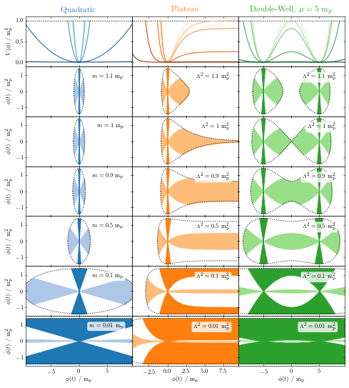
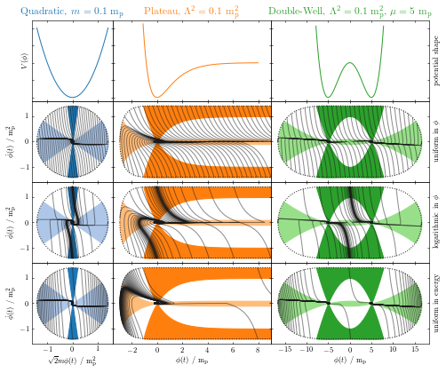
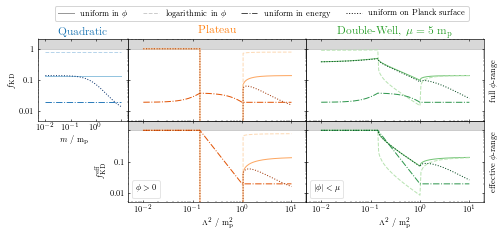

pynflation
==========

Code evolving the Friedmann equations and the equation of motion for a single scalar "inflaton" field. This allows us to generate the following phase-space plots (from `arXiv:1809.07185 <https://arxiv.org/abs/1809.07185>`_ to be published in Phys. Rev. D).

    
    The top row shows the quadratic (blue), plateau (orange) and double-well (green) inflaton potential, respectively, with lines growing darker with decreasing inflaton mass or potential amplitude. The other panels depict inflaton phase-space diagrams for the corresponding potentials with inlaton mass or potential amplitude decreasing from the second row down. The enveloping dotted line delimits the Planck surface. The lightly shaded area corresponds to the region where cosmic inflation takes place. Dark shading corresponds to the region where the kinetic energy of the inflaton dominates over the potential energy. Realistic values for the inflaton mass or the potential amplitude, i.e. values conforming with data from e.g. the Planck satellite, are orders of magnitude smaller (i.e. extrapolating the row of panels further down) than the values picked here for reasons of visualisation.

    
    The first row shows qualitative shapes of the potentials. The remaining rows are phase-space diagrams with inflaton trajectories for the quadratic (blue), plateau (orange), and double-well (green) potentials. Dark shading highlights the region of kinetic dominance, whereas light shading corresponds to the regions where cosmic inflation happens. The trajectories start from the Planck surface (black dotted line), where the initial conditions were set with a uniform prior on the inflaton phi in the top row, with a logarithmic prior on the inflaton phi in the middle row, and with a uniform prior on the potential energy in the bottom row.

    
    The fraction of inflaton phase-space trajectories starting in the kinetically dominated region (dark shaded region in above plots) is shown for various priors as a function of the inflaton mass for the quadratic potential (blue) or as a function of the root potential amplitude for the plateau and double-well potential. The second row shows how the fraction changes when the inflaton is restricted to the range that is effectively of interest for the given type of potential.
